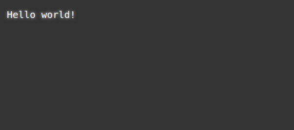
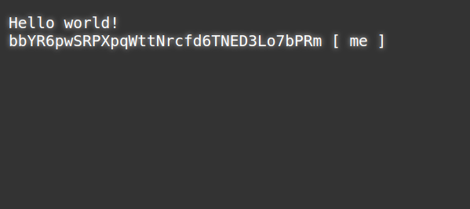
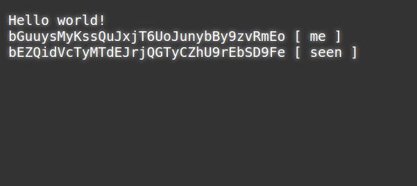
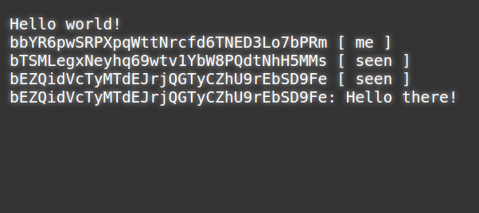
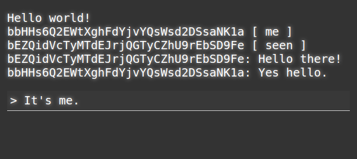

### Build a decentralized web chat in 15 minutes

In this 15 minute tutorial we're going to build a simple decentralized chat application which runs entirely in a web browser.

All you will need is a **text editor**, a **web browser**, and a **basic knowledge of how to save HTML** files and open them in the browser.


We're going to use [Bugout](https://chr15m/bugout), a JavaScript library that takes care of the peer-to-peer networking and cryptography.

 * If you just want the files, download [index.html](./index.html) in this repo.

Ok, let's get started!

### Start with the HTML boilerplate

To keep this tutorial simple we're going to do everything in one `.html` file using pure Javascript. We're not going to use any build tools, minifiers, language transpilers, etc. You'll probably need those things when you build something more complicated but for the purposes of this tutorial we'll stick with good old fashioned HTML and JavaScript.

The first thing we need is a basic boilerplate web page into which we can start building our application. We also need a simple function to output text on the screen. Here's the HTML you can use to get started:

```html
<!DOCTYPE html>
<html>
<head>
  <meta charset="utf-8">
  <meta content="width=device-width, initial-scale=1" name="viewport">
  <title>Bugout chat tutorial</title>
  <style>
    body { background-color: #333; font-size: 1.5em; padding: 0em 0.25em; }
    pre { color: #fff; white-space: pre-wrap; word-wrap: break-word; text-shadow: 0 0 10px #ccc; }
  </style>
  <script>
    function log(message) {
      document.getElementById("log").textContent += message + "\n";
    }
  </script>
</head>
<body>
  <pre id="log"></pre>
</body>
<script>
  log("Hello world!");

  /***** Your code goes here! *****/

</script>
</html>
```

Go ahead and save the snippet above into a file called `index.html` and then open that file in your web browser.

You should see the words "Hello world!" in white text at the top of the screen.



Great, we are up and running with a basic web page and a `log()` function which will print text on the screen.

### Import Bugout

Now let's get the [Bugout](https://chr15m/bugout) library imported so we can use it to connect peoples' browsers together in a peer-to-peer style. We'll load the library directly from its GitHub page.

Add this `<script>` tag into the `<head>` section of the HTML just before the closing `</head>` tag:

```html
<script src="https://chr15m.github.io/bugout/bugout.min.js" type="application/javascript"></script>
```

Save your `index.html` file again and hit refresh in the browser. If you know [how to use the developer console](https://www.digitalocean.com/community/tutorials/how-to-use-the-javascript-developer-console) you can check the network tab to verify the `bugout.min.js` file getting loaded in. If you don't, don't worry just skip this step and move on.


### Make a Bugout object

Let's make a Bugout object that we can use to talk to other browsers. Add the following code at the end of the file in the script tag after it says "Your code goes here!":

```javascript
  var b = Bugout();
  log(b.address() + " [ me ]");
```

Now when you hit reload you should see "Hello world!" like before and on the next line you should see the address of this Bugout instance. It will look something like this: `bKpdPiLJjPmwrYWoZYXVWbJFcEMUpfh6BN [ me ]`.



You might notice this address looks a bit like a Bitcoin address. That's because Bugout uses a similar type of cryptographic technique to create its address from an internal cryptographic keypair. Cryptography is how Bugout nodes can be sure they are receiving information from the node they think they are receiving it from. On the network Bugout nodes can find and identify eachother using these addresses.

### Connect your Bugout instance

Now that we have a Bugout instance running in our web page, how do we connect it to other Bugout instances running in pages on other people's computers?

In real life when you want to meet up with somebody you share the address of the place to meet. Computers are the same. Any time you want to connect two computer programs together over a network you need some type of address. For example to get to this web page you followed a link to its URL, and your computer loaded this page from that address.

Bugout instances connect to addresses called "identifiers" which you can think of as room names. The first argument passed to the `Bugout()` instance is the identifier or room name that you want it to connect to.

If you don't supply a room name argument the Bugout instance will connect to it's own `.address()` by default. That means it will listen out for other Bugout instances connecting back to it. Other instances can connect by passing your Bugout instance's `.address()` in as their first argument.

For our chat room we want to connect all the Bugout instances together in one room. We do that by using the same room name as the first argument.

Update the code to pass an argument `"bugout-chat-tutorial"` as the room name. We'll also install an event handler which will fire every time we see another Bugout instance connecting to the same room using `b.on("seen")`.

Replace the line `var b = Bugout();` with the following code. Leave the address logging line in there.

```javascript
var b = Bugout("bugout-chat-tutorial");
b.on("seen", function(address) { log(address + " [ seen ]"); });
```

When you refresh the page now you may see other Bugout instances connecting - those are other people doing this same tutorial! You can open the `index.html` in another tab or browser and after a few seconds in both windows you should see the two Bugout instances discover eachother and output `...ADDRESS... [ seen ]` with eachother's address.



### Receiving messages

Now that we have Bugout instances connecting we can send data between them. Let's handle receiving messages first. When our Bugout instance receives a message we want to add it straight to the log so we can see what messages people are sending to the room.

Add this snippet of JavaScript below the Bugout instantiation code you added before:

```javascript
b.on("message", function(address, message) {
  log(address + ": " + message);
});
```

This code will log every message our Bugout instance receives with the address of the sender.

If you refresh the page at this point you may start to see messages coming in from anybody else who has done this tutorial and is sending messages since you are in the same room called `"bugout-chat-tutorial"`.



### Sending messages

Sending a message is just as easy. We can use `b.send("Hello world!");` to send a message to the room or `b.send(address, "Hello you.");` to send to a specific Bugout instance. If you use the second method the transmission will be encrypted with a key supplied by the receiving instance (if the other party is online).

But before we add the sending functionality we need a way for users to type in the messages they want to send, so let's take a little user-interface detour.

### Get user input

We need some kind of input for users to type messages they want to send.

First create an input they can type into. Add the following tag just below the `<pre id="log">` tag:

```html
  <pre id="input" contenteditable="true"></pre>
```

Now add some styling to make it clear this is an input that the user can type into. Add this to the `<style>` section of the header:

```css
    #input { border-bottom: 1px solid #ccc; background-color: #383838; padding: 0.25em; outline: 0; }
    #input::before { content: "> "; }
```

Finally, we can hook this all up. We'll add an event handler which will send the message the user has typed as soon as they hit the enter key. Add this to the JavaScript tag after the other code you have added so far:

```javascript
  document.getElementById("input").onkeydown = function(ev) {
    if (ev.keyCode == 13) {
      if (b.lastwirecount) {
        b.send(ev.target.textContent);
        ev.target.textContent = "";
      }
      ev.preventDefault();
    }
  }
```

There's a couple of extra things to note here. We're checking for key code 13 (the enter key) and we're also checking `lastwirecount` to make sure we only send a message once we have seen another Bugout instance to send to. So you will need to have two different copies of `index.html` loaded in different tabs or browsers to make this work.

Refresh again and once you see the `[ seen ]` messages you can start typing messages between the windows. You might even see messages coming from other people doing this tutorial.



So that's it, our super minimal decentralized chat client is done. Enjoy!

If this tutorial was useful and you want to know more about the decentralized stuff I am building you can find me here:

 * [Subscribe to my newsletter](https://mccormick.cx/subscribe)
 * [Follow me on Twitter at @mccrmx](https://twitter.com/mccrmx)
 * [Send me an email](mailto:chris@mccormick.cx?subject=Bugout) (I freelance too)
 * [Follow the cryptography/decentralization tag on my blog](https://chr15m.github.io/tag/cryptography.html)

### Find out more

You can find out more about [Bugout on the GitHub project page](https://github.com/chr15m/bugout). You can also `npm install` it if that's your thing.

There is also [API documentation](https://github.com/chr15m/bugout/blob/master/docs/API.md) where you can look up all Bugout methods, events, and properties.

If you want a more fleshed out decentralized web chat inspired by IRC then [check out dirc](https://chr15m.github.io/dirc).

### Go further

Astute readers will have some questions at this point.

 * Isn't WebRTC signalling still centralized?
 * What happens to the messages when somebody goes offline?
 * How can do we handle identities when there's no central server?

For some possible solutions to the last question you can check my post on [decentralized identity linking](https://chr15m.github.io/decentralized-identity-linking.html).

I'm actively working on the first two questions. If you want to find out more and keep up with what I'm building you can find me at the links above.

I would love to hear from you about the decentralized things you are building too!
